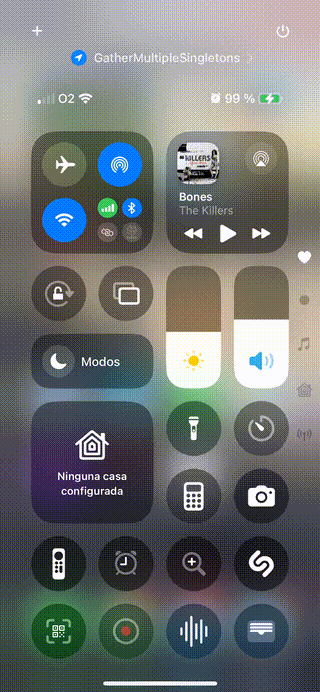

# GatherMultipleSingletons

This repository contains a sample iOS application built in **Xcode** and migrated to **Swift 6.0**. The app demonstrates how to gather several Singletons in a unique structure, this allows dependency injection for unit tests. This is the base code in which is based following in the post [Safely Gathering Singletons While Avoiding Data Races](https://javios.eu/swift/safely-gathering-singletons-while-avoiding-data-races/)


## 🎥 Demo Video

Check out the app in action!  
  


## Requirements

- **Xcode 15.0 or later**
- **iOS 16.0 or later**
- **Swift 6.0**

## Getting Started

1. Make sure you have Xcode installed.
2. Clone this repository:
   ```bash
   git clone https://github.com/JaCaLla/GatherMultipleSingletons.git

